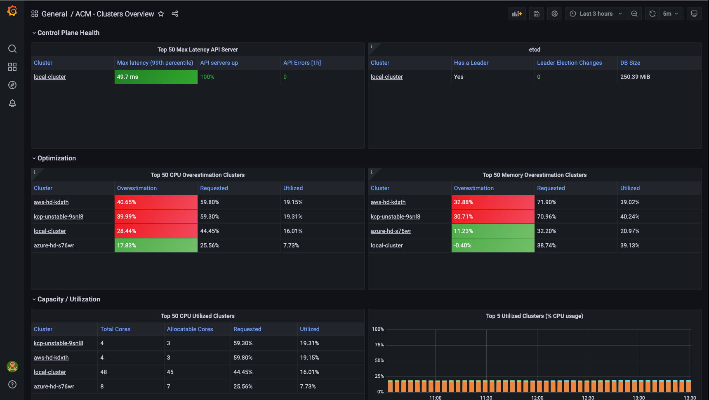
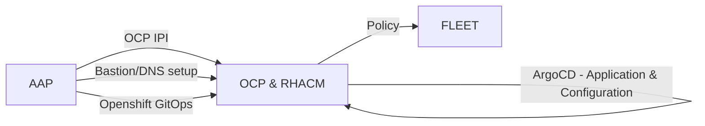
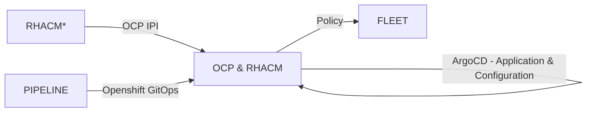

# Design Decisions

Preface: [https://www.redhat.com/en/blog/how-does-red-hat-support-day-2-operations](https://www.redhat.com/en/blog/how-does-red-hat-support-day-2-operations)

## Day 0 Operations

### Planning - How do we do Ops

#### Project: AOC

- We use a multiple github repository to allow us to deploy and operate RHACM.
- For application and configuration data, we define kustomization overlays to cover each distinct deployment targets. Targets make up different stage environments or different region environments.
- We use Ansible Automation Platform to trigger Ansible Playbooks to build the infrastructure that make up the management components. This includes the ansible playbook to deploy OCP as a private cluster on Azure. We also define ansible playbooks to import AKS clusters into ACM. We need to support multiple ACM deployments across multiple regions.
- To limit costs, We support a two stage deployment workflow: development and production. Developers are still able to deploy sandbox environments, using an internal RHACM infrastructure cluster, with has support for cluster pools.
- We develop in the cloud.
- For the AOC project we use gitops with Openshift Gitops to deploy RHACM workload and configuration data. The image below is a sample the current set of ArgoCD applications we have defined.

[](./images/acm_24_argocd_applications.png)

#### Project: KCP

- The source of the configuration for this cluster is held in the [Openshift-pipelines](https://github.com/stolostron/openshift-pipelines/tree/main/kcp-sgs-pipelines) repository, directly in the `kcp-sgs-pipelines` directory. The source for [autoscale hypershift](https://github.com/stolostron/openshift-pipelines/tree/main/autoscale-hypershift) is also held in this repository in the `autoscale-hypershift` directory.
- This project leverages an existing RHACM infrastructure to deploy the public OCP clusters into which we will deploy the RHACM instance to support the project. The initial OCP clusters are detached from the infrastrucutre RHACM.
- The deployment of RHACM into OCP clusters will be managed by Openshift Pipelines.
- Openshift Pipeline will deploy Openshift Gitops, and similar to the AOC project, we will use Argocd to handle the rollout of ACM, the ACM configuration, the Singapore controller, and cluster registration controller.
- Once RHACM is successfully installed, the pipeline will configure HyperShift on the local cluster, converting the local cluster managedcluster into a HyperShift Hosting Cluster.
- The KCP cluster will be configured with 3 HyperShiftDeployments on its localcluster hosting cluster, 1 Azure and 1 AWS HyperShiftDeployment are configured to target KCP Stable, whereas the last AWS HyperShiftDeployment is configured to target KCP unstable.
- Autoscale HyperShift is deployed on this cluster as well, to ensure that HyperShiftDeployments are scaled up/down automatically on a preexisting schedule to aid in cost savings efforts. As of now, HyperShiftDeployments will scale down every Friday at Midnight, and scale up every Monday at 1 AM.
    - A label of `autoscale-hypershift=skip` can be added to the HyperShiftDeployment to ensure it is not affected by the automated scaling
    - When scaling down, autoscaling is turned off and the replicaCount is set to 1
    - When scaling up, autoscaling is turned on and the minimum replicas is set to 2 and max to 5
- Observability is installed on this cluster and AlertManager is configured to forward warning and critical alerts to slack and GitHub. PagerDuty will alert on critical alerts as well.

  

#### Commonality across all RHACM deployments

### Planning - Sizing

### One ACM Hub / Bastion Host per Region

- Currently, we support AKS cluster deployed across the NA region. A single ACM hub cluster will be available to import and manage all the AKS clusters in the North America region.
- The EMEA region will consist of Europe, Middle East, and Africa countries.

### DNS Setup
TODO

## Day 1 Operations

### New Environment Deployments

- The Ansible project [ocp4-azure-ipi](https://github.com/rcarrata/ocp4-azure-ipi) was [forked](https://github.com/stolostron/ocp4-azure-ipi) and is used to deploy OCP clusters. Red Hat Ansibile Automation Platform is used to perform the Day 1 deployment of the Openshift Clusters.
- A series of Ansible playbooks from [acm-aap-aas-operations](https://github.com/stolostron/acm-aap-aas-operations) are used to:
  - configure the Bastion VM
  - Setup DNS configuration
  - bootstrap the Openshift Gitops. Openshift Gitops handles rolling out and maintain the set of application and configuration to the ACM hub cluster, or local cluster.
- ACM policy is used for maintain configuration across the fleet of managed clusters.

Project: AOC



Project: KCP


## Day 2 Operations

### Importing AKS Clusters

AKS clusters are imported into the ACM hub as a Day 2 operation using an ansible playbook.
The playbook is idempotent and runs against an inventory of AKS clusters. The inventory is dyanmic, where targets can be added and removed. In this way, a single playbook can be used against inventories from different stages--dev and production, or different regions.

The following tasks are performed on each cluster:

1. Setup networking to allow the AKS cluster to access the ACM k8s endpoint.
2. Setup networking to allow the AAP cluster to access the AKS k8s endpoint.
3. Generate the ManageCluster CR on the ACM hub.
4. Read and apply the generated import secret on the AKS cluster.

!!! reference

    See details at [1.8.2. Importing a managed cluster with the CLI](https://access.redhat.com/documentation/en-us/red_hat_advanced_cluster_management_for_kubernetes/2.5/html/clusters/managing-your-clusters#importing-a-managed-cluster-with-the-cli)


As new AKS clusters come online, the ansible playbook running on a schedule will iterate over the inventory of clusters and import the clusters into ACM. 

!!! note

    If it takes 5m to run the import playbook from start to end for a single AKS cluster, then iterating over 100 AKS clusters, will take 500m or 8.3 hours, as a rough estimate. Enabling parallism will reduce the total time.

Currently, the import procedure follows the out of the box import procedure, using a Service Account with cluster-admin rolebinding to generate the managed cluster namespace, and create the Managed Cluster CR. The best practice is always to use the mininal privilege as possible, so we question, if customers in general are ok with using a cluster-admin role to import all their clusters.

An alternative import procedure is available, that uses a generic import payload to be applied on the AKS cluster, and a service account with minimal privledge. This requires the ACM hub to be configured to generate a generic payload. Using this procedure will simplify the import procedure by not having to access the ACM hub cluster during the import procedure. We would just need to access the target cluster. This alternative process will still be a Day 2 operation.


### Backup and Restore | Disaster Recovery

TBD

### Upgrade - OCP

We are following the following OCP upgrade policy:

- The ACM SRE maintenance window is between Sunday night (CST) and Wednesday morning (CST).
- We are following OpenShift **stable** upgrade channel
- OCP minor version release upgrades will happen during this window. 
    - We will deploy the latest version, weekly.
- OCP major version release upgrades will happen during this window.
    - We will upgrade to the next release, 1 week after it is available.
- Development stage is upgraded first.
- Production(s) stage is upgraded next.

#### Gitops procedure for upgrading OCP

This is driven by an ACM Policy that applies the expected ClusterVesion Custom Resource. <Add link>

### Upgrade - ACM

- The upgrade of RHACM will happen during the upgrade maintenance window from Sunday night (CST) to Wedneday morning (CST). This allows us to provide business hour support across the maintenance windown.
- We will upgrade ACM on the maintenance window following the release of RHACM.
- Development stage is upgraded first.
- Production(s) stage is upgraded next.

#### Gitops procedure for upgrading RHACM 2.4 to RHACM 2.5

There is a known blocker [issue](https://bugzilla.redhat.com/show_bug.cgi?id=2095195) for upgrading RHACM from 2.4 to 2.5 when the cluster proxy addon is enabled. Before upgrading from 2.4 to 2.5 we also need to disable the backup feature. 

The following steps includes the workaround to allow the upgrade with Gitops.

1. Create PR update MultiClusterHub CR to disable proxy addon
```yaml
spec:
 enableClusterProxyAddon: false
```
2. Create PR to update ACM subscription
```yaml
spec:
 channel: release-2.5
 installPlanApproval: Manual
 name: advanced-cluster-management
 source: redhat-operators
 sourceNamespace: openshift-marketplace
```
3. Login to the OCP console to review and approve the install plan for release 2.5 upgrade.
4. After the RHACM 2.5 upgrade completes successfully, create PR to update MultiClusterHub CR to re-enable the cluster proxy addon.
```yaml
apiVersion: operator.open-cluster-management.io/v1
kind: MultiClusterHub
metadata:
  name: multiclusterhub
  namespace: open-cluster-management
spec:
  overrides:
    components:
      - enabled: true
        name: cluster-proxy-addon
      - enabled: true	
        name: multiclusterhub-repo	
      - enabled: true	
        name: search	
      - enabled: true	
        name: management-ingress	
      - enabled: true	
        name: console	
      - enabled: true	
        name: insights	
      - enabled: true	
        name: grc	
      - enabled: true	
        name: cluster-lifecycle	
      - enabled: true	
        name: volsync	
      - enabled: true	
        name: multicluster-engine	
      - enabled: false	
        name: cluster-backup
```
5. Manually delete the secret cluster-proxy-signer and let cluster-proxy-addon-manager to refresh it. 
```bash
oc delete secret cluster-proxy-signer -n open-cluster-management
```

### Alerts and Alert Management

TBD

### Observability

TBD
