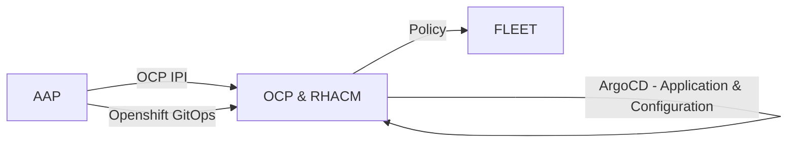
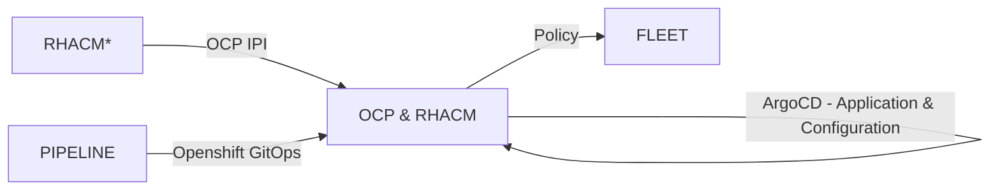

# Design Descisions

Reference: [https://www.redhat.com/en/blog/how-does-red-hat-support-day-2-operations](https://www.redhat.com/en/blog/how-does-red-hat-support-day-2-operations)

## Day 0 Operations

### Planning - How do we do Ops

#### Project: AOC

- We use a multiple github repository to allow us to deploy and operatoe RHACM.
- For application and configuration data, we define kustomization overlays to cover each distinct deployment targets. Targets make up different stage environments or different region environments.
- We use Ansible Automation Platform to trigger Ansible Playbooks to build the infrastructure that make up the management components. This includes the ansible playbook to deploy OCP as a private cluster on Azure. We also define ansible playbooks to import AKS clusters into ACM. We need to support multiple ACM deployments across multiple regions.
- To limit costs, We support a two stage deployment workflow: development and production. Developers are still able to deploy sandbox environments, using an internal RHACM infrastructure cluster, with has support for cluster pools.
- We develop in the cloud.
- For the AOC project we use gitops with Openshift Gitops to deploy RHACM workload and configuration data. The image below is a sample the current set of ArgoCD applications we have defined.

[](./images/acm_24_argocd_applications.png)

#### Project: KCP

- This project leverages an existing RHACM infrastructure to deploy the public OCP clusters into which we will deploy the RHACM instance to support the project. The initial OCP clusters are detached from the infrastrucutre RHACM.
- THe deployment of RHACM into OCP clusters will be managed by Openshift Pipelines.
- Openshift Pipeline will deploy Openshift Gitops, and similar to the AOC project, we will use Argocd to handle the rollout of ACM and ACM configuration.

#### Commonailty across all RHACM deployments

### Planning - Sizing

### One ACM Hub / Bastion Host per Region

- Currently, we support AKS cluster deployed across the NA region. A single ACM hub cluster will be available to import and manage all the AKS clusters in the North America region.
- The EMEA region will consist of Europe, Middle East, and Africa countries.

## Day 1 Operations

### New Environment Deployments

- The ansible project https://github.com/rcarrata/ocp4-azure-ipi was forked to https://github.com/stolostron/ocp4-azure-ipi and is used to deploy OCP clusters. Red Hat Ansibile Automation Platform is used to perform the Day 1 deployment of the Openshift Clusters.
- An ansible playbook from REPO is used to bootstrap the Openshift Gitops. Openshift Gitops handles rolling out and maintain the set of application and configuration to the ACM hub cluster, or local cluster.
- ACM policy is used for maintain configuration across the fleet of managed clusters.

Project: AOC



Project: KCP



## Day 2 Operations

### Importing AKS Clusters

AKS clusters are imported into the ACM hub as a Day 2 operation based on an ansible playbook.
The idempontent playbook is run against an inventory of AKS clusters.

The following tasks are performed on each cluster:

1. Setup network to allow the AKS cluster to see the ACM hub
2. Setup networking to allow the AAP cluster to access the k8s endpoint.
3. Generate the ManageCluster CR
4. Read the generated import secret, and apply these on the AKS cluster.

As new AKS clusters come online, the ansible playbook running on a schedule will iterate over the inventory of clusters and import the clusters into ACM. 

!!! note

    If it takes 5m to run the import playbook from start to end for a single AKS cluster, then iterating over 100 AKS clusters, will take 500m or 8.3 hours, as a rough estimate. Enabling parallism will reduce the total time.


An alternative import procedure is available, that uses a generic import payload to be applied on the AKS cluster. This requires the ACM hub to be configured to generate a generic payload. Using this procedure will simplify the import procedure by not having to access the ACM hub cluster during the import procedure. We would just need to access the target cluster. This will still be a Day 2 operation.


### Backup and Restore | Disaster Recovery

Stuff

### Upgrade - OCP

We are following the following OCP upgrade policy:

- The ACM SRE maintenance window is between Sunday night (CST) and Wednesday morning (CST).
- OCP minor version release upgrades will happen during this window. 
    - We will deploy the latest version, weekly.
- OCP major version release upgrades will happen during this window.
    - We will upgrade to the next release, 1 week after it is available.
- Development stage is upgraded first.
- Production(s) stage is upgraded next.

### Upgrade - ACM

- The upgrade of RHACM will happen during the upgrade maintenance window from Sunday night (CST) to Wedneday morning (CST). This allows us to provide business hour support across the maintenance windown.
- We will upgrade ACM on the maintenance window following the release of RHACM.
- Development stage is upgraded first.
- Production(s) stage is upgraded next.

Manual procedure for upgrading RHACM 2.4 to RHACM 2.5:

1. Ensure there is a OADP backup of RHACM
2. Disable the backup and restore capability in the multiclusterhub operand
3. Disable the clusterproxy capability in the multiclusterhub operand (See bz: )

```bash
oc patch
```

4. Change the RHACM subacription channel to `release-2.5`.
5. Select the version and apply to upgrade.

#### Gitops procedure for upgrading RHACM 2.4 to RHACM 2.5:

### Alerts and Alert Management

Stuff

### Observability

Stuff
