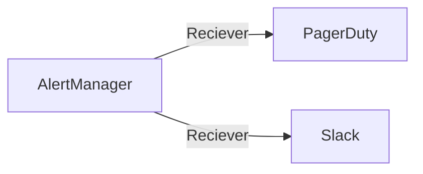
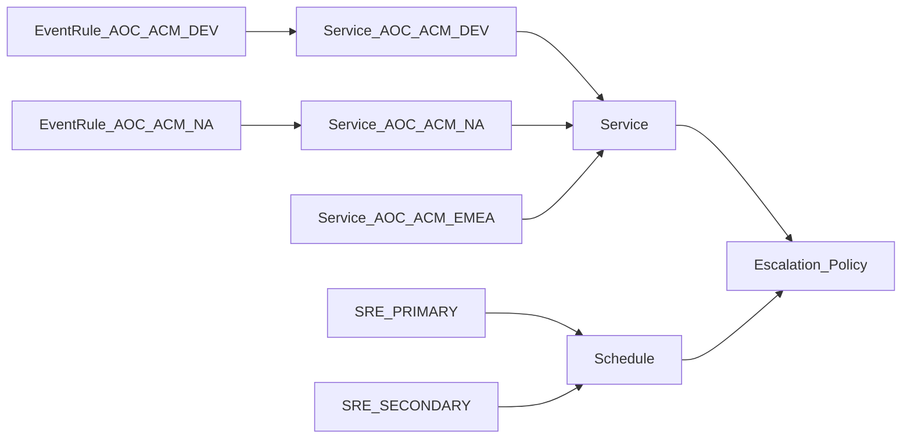

# Operations

## On-Call Escalation Coverage

### Level 1: Normal Business Hours

With SRE members in three separate timezones, we can support follow the sun SRE coverage, with normal business hours.

* 8h shifts starting from 8AM Xian Sunday to Friday, with Austin on call to 6PM 
* For coverage on Sundays, if Paris team is excluded, we can still cover with 12h shift between Xian and Austin/Boston.

* In Pagerduty, we should have a primary schedule with starting times in each timezone at 8AM, ending at 5PM, except in Austin, where the end is 6PM.

### Level 2: Exceptions

For shifts outside the normal work week (Saturday/Sunday) and PTO/Holidays, we'll have a sign up sheet.

* Exceptions are filled in Pagerduty manually.

To implement these hours, we'll create a secondary schedule, and this scheule will be used to populate the dates from the signup sheet.

### Level 3: Catch All

A final catch all schedule be created to handle any incidents that are not acknowledged, will be covered by this final group.

## PagerDuty Integration Flow

This is our current integration flow to PagerDuty.

It is also possible to integrate Prometheus directly to PagerDuty.

## PageDuty Configuration

### Event RuleSet

* We created incoming event source for the three environments: dev, prod-na, prod-emea.
* Each event source has their own `integration-key`, that is used in the alertmanager configuration.
* Each ruleset will be associated to the corresponding service: dev, prod-na, prod-emea.

## Shifts

Currently, we have Primary schedule as 8h shifts. For the Secondary schedule, should this be changed to 12h shifts like other teams?
