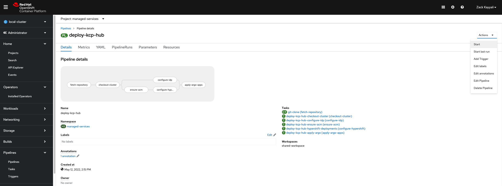
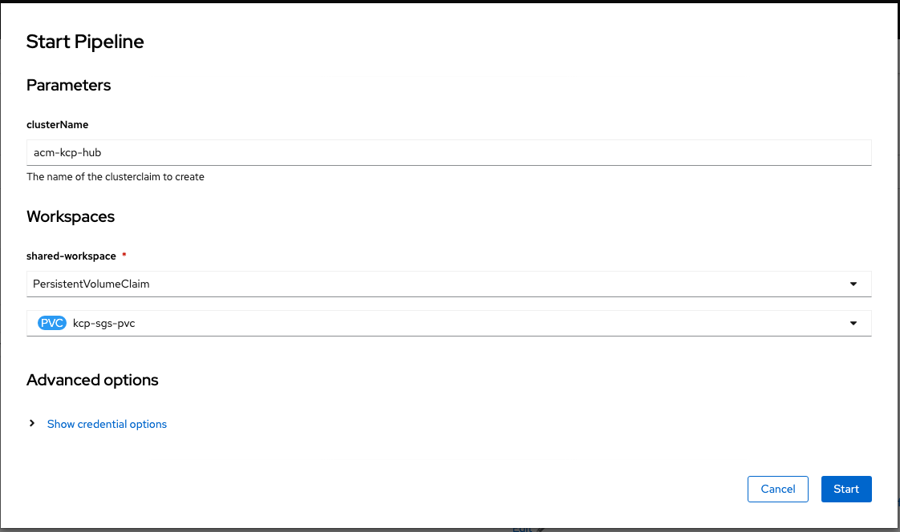
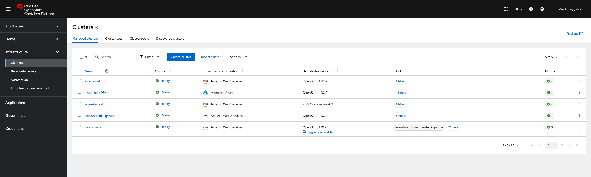
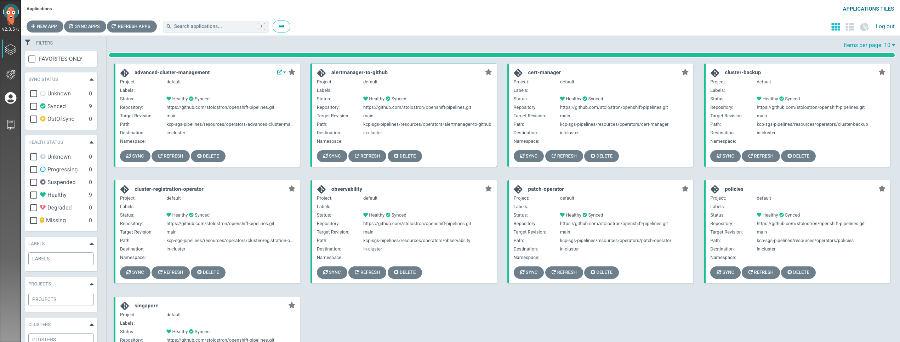
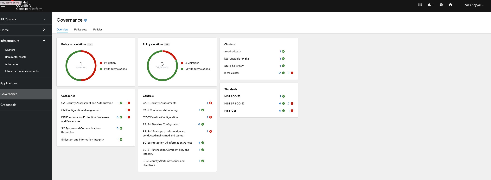
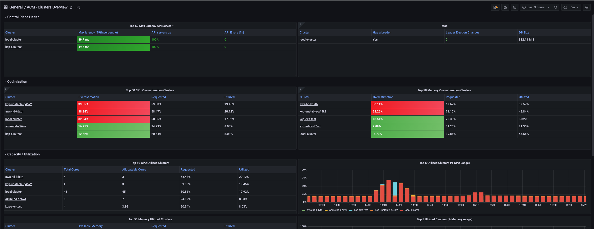

# KCP Pipeline

## About

This runbook will explain how to deploy the KCP/SGS pipeline and cluster, how to managed the cluster, and troubleshooting tips.

The KCP/SGS cluster is deployed and configured via OpenShift Pipelines (Tekton), and managed via OpenShift GitOps (ArgoCD).

Currently the [pipeline](https://github.com/stolostron/openshift-pipelines/blob/main/kcp-sgs-pipelines/pipeline.yaml) is deployed on [Collective](https://console-openshift-console.apps.collective.aws.red-chesterfield.com/k8s/ns/managed-services/tekton.dev~v1beta1~Pipeline/deploy-kcp-hub). The pipeline can be triggered from here directly or it can be installed on a fresh cluster. Once the pipeline is installed, it can be ran to create new hub(s) or update an existing hub. This pipeline is idempotent as well.
 

## Deploying the KCP/SGS Pipeline

### About the Pipeline

The KCP/SGS pipeline works by checking out a cluster from a clusterpool, then configures it by installing operators, deploying hypershiftdeployments, deploying argo apps, policies, observability, IDP, and more. The pipeline must be deployed in the same namespace as the clusterpool it will use.

### Prereqs

- OCP 4.10+ Cluster
    - OpenShift Pipelines Operator Installed
    - Advanced Cluster Management 2.4+ Operator Installed
    - 3 Masters 3 Workers, all m6a.2xlarge to ensure adequate storage
- A ClusterPool deployed and configured
    - [sample clusterpool](https://github.com/stolostron/openshift-pipelines/blob/main/kcp-sgs-pipelines/prereqs/clusterpool_template.yaml)

### Steps

1. Clone the [openshift-pipelines](https://github.com/stolostron/openshift-pipelines) repository
2. Fill out [prereqs secrets](https://github.com/stolostron/openshift-pipelines/blob/main/kcp-sgs-pipelines/prereqs/secrets_template.yaml). 
    1. Rename file as 'secrets.yaml'
    2. Each field is required
    3. Apply secret - 
        `oc apply -f kcp-sgs-pipelines/prereqs/secrets.yaml`
3. Apply the clusterpool and tasks
    1. Ensure the [clusterpool name](https://github.com/stolostron/openshift-pipelines/blob/main/kcp-sgs-pipelines/pipeline.yaml#L35) is the same as the one configured in the prereqs.
    2. Apply clusterpool - `oc apply -f kcp-sgs-pipelines`

## Running the Pipeline

The pipeline can be triggered from the OpenShift UI, by viewing the Pipeline, and clicking 'Start' -

After clicing 'Start' a modal will open up. In this modal, enter the 'clusterName'. This will become the clusterClaim name for the hub. Also select a Workspace. The workspace is a local filestore for the Pipeline. The workspace must be of type PVC. Click 'Start' to trigger the pipeline.

The pipeline can take about 20 minutes to run to completion. At completion, it should have 3 HyperShiftDeployments configured, and several Argo apps like shown below.

### Clusters View

### Argo View

### Policies View

### Observability View

